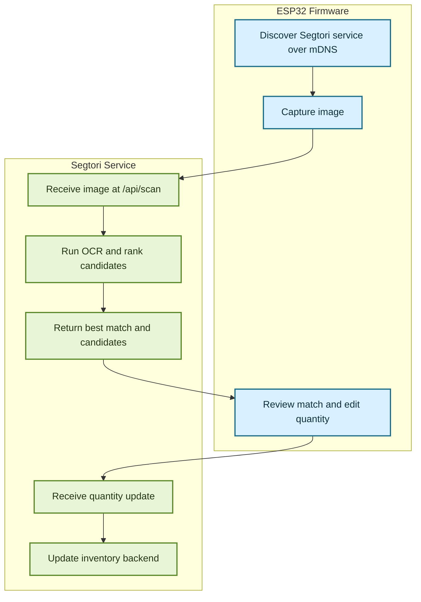

# Segtori

Segtori, the Seglectic Tagged Object Recognition Interface, is a handheld inventory tool built around an ESP32-CAM and a small OCR service on the local network.

The device captures a label or bin tag, sends the image to the server, receives the closest inventory match, and lets the operator update quantity from the handheld controls.

## What It Does

- captures still images on an ESP32-CAM
- discovers the local Segtori service over mDNS
- runs OCR with Tesseract on the server
- matches recognized text against inventory records
- returns the best match plus ranked candidates
- updates quantity through a stable device-facing API

## System Flow



## Repository Layout

- `firmware/` ESP32-CAM firmware, controls, display state, discovery, and HTTP calls
- `service/` OCR server, Airtable integration, matcher, scan job handling, and packaging
- `util/` developer tools, including the `toriTest` local service tester
- `docs/` architecture notes, roadmap phases, and design direction

## Current Stack

- Firmware: PlatformIO + Arduino on `esp32cam`
- Service: Node.js 20 + Express
- OCR: host-installed `tesseract`
- Discovery: `_segtori-ocr._tcp.local`
- Inventory backend: Airtable

## Current Service API

- `GET /api/health` returns service metadata and port information
- `POST /api/scan` accepts an uploaded image under `image`
- `POST /api/match-text` accepts manual text for match testing
- `POST /api/items/:id/quantity` updates item quantity

## Local Development

The intended development loop runs the service directly on the host machine.

1. Configure the service with `service/.env`.
2. Start the server from `service/` with `npm start` or `npm run dev`.
3. Use `util/toriTest/toriTest.py` to test discovery, OCR results, and candidate ranking without the ESP32.

Run the tester with:

```bash
cd util/toriTest
uv run toriTest.py
```

## Configuration Notes

Key Airtable-related variables live in `service/.env`:

- `AIRTABLE_API_TOKEN`
- `AIRTABLE_BASE_ID`
- `AIRTABLE_TABLE_ID`
- `AIRTABLE_ITEM_ID_FIELD`
- `AIRTABLE_ITEM_NAME_FIELD`
- `AIRTABLE_ITEM_SECONDARY_NAME_FIELD`
- `AIRTABLE_QUANTITY_FIELD`

In the current service model:

- `name` is sourced from `AIRTABLE_ITEM_NAME_FIELD`
- `secondaryName` is sourced from `AIRTABLE_ITEM_SECONDARY_NAME_FIELD`

That matters for both match scoring and what the tester displays as `Name` and `PartNumber`.

## Documentation

- [docs/README.md](./docs/README.md) project summary and defaults
- [docs/architecture.md](./docs/architecture.md) subsystem boundaries and API shape
- [docs/phases.md](./docs/phases.md) roadmap and phase index
- [docs/design.md](./docs/design.md) device UX direction
