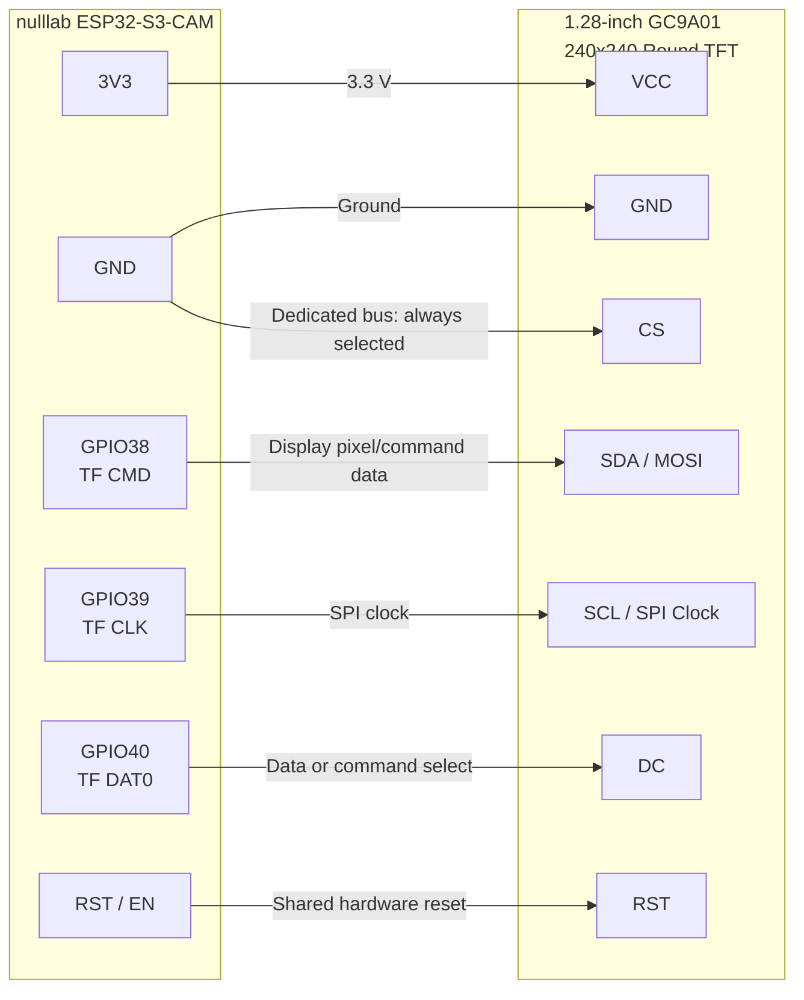

# nulllab ESP32-S3-CAM Hardware Reference

The primary Phase 1 development board is the
[nulllab ESP32-S3-CAM](https://github.com/nulllaborg/esp32s3-cam).
The upstream repository remains the source of truth for the complete
[schematic](https://github.com/nulllaborg/esp32s3-cam/blob/main/esp32s3_cam_sch.pdf).
This document records the board details that directly affect Segtori.

## Board Configuration

- SoC: ESP32-S3R8, dual-core up to 240 MHz
- Flash: 8 MB
- PSRAM: 8 MB octal PSRAM
- Camera used for current development: OV3660
- Camera support listed upstream: OV3660 and OV2640
- Programming and serial monitoring: native USB-C USB Serial/JTAG
- PlatformIO environment: `nulllab_esp32s3_cam`

## Segtori-Relevant Pins

| Function | GPIO | Notes |
| --- | ---: | --- |
| Boot / current snap button | 0 | Active-low; holding during reset enters download mode |
| Double white camera flashlight | 3 | Active-high; Segtori drives it low at boot |
| Camera SCCB SDA | 4 | Camera control bus |
| Camera SCCB SCL | 5 | Camera control bus |
| Camera VSYNC | 6 | Camera interface |
| Camera HREF | 7 | Camera interface |
| Camera Y4 | 8 | Camera interface |
| Camera Y3 | 9 | Camera interface |
| Camera Y5 | 10 | Camera interface |
| Camera Y2 | 11 | Camera interface |
| Camera Y6 | 12 | Camera interface |
| Camera PCLK | 13 | Camera interface |
| Camera XCLK | 15 | Camera interface |
| Camera Y9 | 16 | Camera interface |
| Camera Y8 | 17 | Camera interface |
| Camera Y7 | 18 | Camera interface |
| USB D- | 19 | Reserved for native USB |
| USB D+ | 20 | Reserved for native USB |
| TF card CMD / MOSI | 38 | Card interface |
| TF card CLK | 39 | Card interface |
| TF card DAT0 / MISO | 40 | Card interface |

## SPI Display Direction

The ESP32-S3R8 has sufficient compute and 8 MB PSRAM for the complete handheld
workflow with a modest SPI preview display. A 320x240 RGB565 frame is about
150 KB, and a 40 MHz write-only SPI bus transfers one raw frame in roughly
31 ms before JPEG decode and controller overhead. Segtori should target an
8-10 FPS framing preview rather than video-rate output.

The display backend should decode each QVGA JPEG preview into small RGB565
blocks and push them directly over SPI. It should not retain a permanent full
display framebuffer. Preview rendering pauses during final capture and upload
so camera DMA, SPI DMA, and Wi-Fi do not compete during the latency-critical
scan path.

When TF-card storage is not required, its documented pads are the first
candidate for a dedicated write-only display bus:

- GPIO39: SPI clock
- GPIO38: SPI MOSI
- GPIO40: available panel control signal

A dedicated display may tie chip select active and use a hardware reset
circuit, reducing required control pins. Final `DC`, chip-select, reset,
backlight, voltage, and exposed-pad wiring must be validated against the chosen
panel and board schematic before enabling a real backend. Using these pads
means the TF card cannot be used concurrently.

### GC9A01 Round Display Wiring

The Teyleten Robot 1.28-inch round display is a 240x240 GC9A01 module with a
write-only four-wire SPI interface. Its exposed pins are `VCC`, `GND`, `SCL`,
`SDA`, `DC`, `CS`, and `RST`.

Use this wiring when the TF-card interface is not needed:

| nulllab ESP32-S3-CAM | GC9A01 Display | Purpose |
| --- | --- | --- |
| `3V3` | `VCC` | Display power and 3.3 V logic |
| `GND` | `GND` | Common ground |
| `GPIO39` / TF `CLK` | `SCL` | SPI clock |
| `GPIO38` / TF `CMD` | `SDA` | SPI MOSI; display data input |
| `GPIO40` / TF `DAT0` | `DC` | Display data/command selection |
| `GND` | `CS` | Permanently selects this dedicated SPI device |
| Board `RST` / `EN` | `RST` | Resets display whenever the ESP32 resets |

This mapping preserves GPIO0 for the current snap button, GPIO3 for the camera
flashlight, and native USB on GPIO19/20. It consumes the complete TF-card
interface, so a microSD card cannot be used at the same time.

Power the module from `3V3`, even though its listing permits 3-5 V input. This
keeps display power and logic levels aligned with the ESP32-S3. Confirm the
physical module labels before applying power; low-cost GC9A01 breakouts can
vary in pin order even when their signal names are the same.

## Double White Flashlight

The two white LEDs beside the camera are the onboard camera flashlight. The
schematic shows GPIO3 driving both SS8050 transistor bases through a shared
10 kΩ resistor. Each transistor switches one LED, with the LED supplied from
3.3 V through its own 2 kΩ resistor.

The flashlight is active-high, controlled as a pair, and can appear dim or
flicker if GPIO3 is left unconfigured. Segtori configures GPIO3 for PWM and
holds it off immediately at boot.

When a snap is accepted, the firmware turns the flashlight fully on before
camera initialization and exposure warm-up. It remains on through the final
capture, then fades out over roughly 200 ms before image upload begins. Error
paths also fade the flashlight out so it cannot remain stuck on.

## Other Onboard LEDs

- A yellow/green charge-status LED is connected to the battery charger IC. It
  is not controlled by ESP32 firmware.
- A separate yellow/green extension-interface LED is connected to GPIO2. It is
  not currently used by Segtori.

## Power Notes

The board includes USB-C power, a PH2.0 battery connector, charging circuitry,
and onboard regulators. The camera and ESP32 can normally become warm during
operation, but a board that becomes too hot to comfortably touch should be
disconnected and inspected.

Segtori reduces idle load by shutting down the camera and lowering CPU
frequency between snaps. During capture, the CPU returns to full speed to
support reliable camera DMA. Preview mode keeps the CPU and camera active, so
display brightness and preview duration will materially affect battery life.

## Firmware Ownership

Board pin assignments live in
[`firmware/include/camera_pins.h`](../../firmware/include/camera_pins.h).
Keep that file and this reference aligned when adding peripherals or changing
board behavior.
