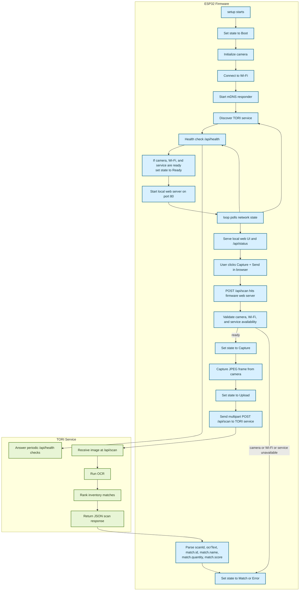

# Firmware

The current firmware is an early ESP32-CAM testing scaffold that exposes a small web console, captures images with the onboard camera, and relays scans to the TORI service.

This is not yet the final handheld UX described in the broader project docs. Right now, the firmware is best understood as:

- a Wi-Fi + mDNS client
- a camera capture endpoint
- a local status web server
- a thin relay to the TORI OCR service

## What It Currently Owns

- camera initialization for the ESP32-CAM OV2640
- Wi-Fi connection and retry behavior
- mDNS startup and TORI service discovery
- periodic health checks against the TORI service
- a local HTTP console on port `80`
- image capture and multipart upload to `POST /api/scan`
- local status tracking for debugging the current flow

## Current Firmware State Model

The firmware reports compact screen states from `ScreenState` in [include/app_state.h](./include/app_state.h):

- `Boot`
- `Wi-Fi`
- `Discovery`
- `Ready`
- `Capture`
- `Upload`
- `Match`
- `Edit`
- `Update`
- `Error`

In the current scaffold, the states most actively exercised are:

- `Boot`
- `Wi-Fi`
- `Discovery`
- `Ready`
- `Capture`
- `Upload`
- `Match`
- `Error`

`Edit` and `Update` exist in the shared state model but are not yet part of the active firmware flow in `main.cpp`.

## Current Debug Flow

This chart reflects the code path in [src/main.cpp](./src/main.cpp) as it exists now.

## Actual Request Flow Today

There are two HTTP layers in the current firmware:

1. The ESP32 hosts a local debugging console.
   - `GET /` serves the scan console page.
   - `GET /api/status` returns current firmware state, last OCR text, last match, and service target.
   - `POST /api/scan` triggers a camera capture on the ESP32 itself.

2. The firmware then acts as an HTTP client to the TORI service.
   - It uploads the captured JPEG to the server’s `POST /api/scan`.
   - It periodically checks `GET /api/health`.

That means the browser never talks directly to the TORI service in the current debug setup. The browser talks to the ESP32, and the ESP32 relays the scan to the service.

## Current Retry And Recovery Behavior

The firmware continuously re-checks network state from `loop()`:

- Wi-Fi reconnect attempts every `12s`
- service rediscovery every `15s`
- service health checks every `15s`

If Wi-Fi is unavailable:

- the device state becomes `Error`
- the IP displays as `offline`
- scans are rejected

If service discovery fails:

- the firmware falls back to `fallbackHost` and `fallbackPort` from `app_config.h`
- later discovery attempts continue in the background

If the TORI service is not healthy:

- scans are rejected with `service unavailable`
- the state moves to `Error` or back to `Discovery`/waiting behavior depending on timing

## Data The Firmware Extracts From The Server

After a successful scan upload, the firmware currently parses:

- `scanId`
- `ocrText`
- `match.id`
- `match.name`
- `match.quantity`
- `match.score`

It does not currently parse or render the full candidate list from the server response.

## Important Caveats

- This firmware currently uses a browser-based local console rather than the final button-and-display handheld flow.
- JSON parsing is intentionally minimal and string-based for now.
- The scan path depends on the server already being reachable and healthy.
- Service discovery is mDNS-first, with a configured fallback host.
- The quantity-edit flow is not yet active in this firmware even though related states exist.

## Files To Read While Debugging

- [src/main.cpp](./src/main.cpp) current boot, network, web console, and scan relay flow
- [include/app_state.h](./include/app_state.h) firmware state model
- [include/app_config.example.h](./include/app_config.example.h) Wi-Fi, mDNS, and fallback config shape
