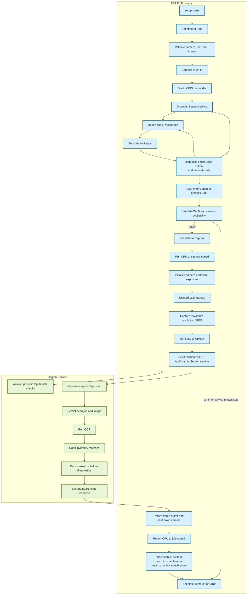

# Firmware

The current firmware is an early ESP32-CAM testing scaffold that captures images with the onboard camera and relays scans to the Segtori service. The default hardware target is the nulllab ESP32-S3-CAM.

## Supported Boards

- `nulllab_esp32s3_cam` (default): [nulllab ESP32-S3-CAM](https://github.com/nulllaborg/esp32s3-cam), with 8 MB flash, 8 MB octal PSRAM, and native USB CDC/JTAG
- `ai_thinker_esp32cam`: legacy AI Thinker ESP32-CAM target

Build the default target from this directory with:

```bash
pio run
```

Build a specific target with:

```bash
pio run -e nulllab_esp32s3_cam
pio run -e ai_thinker_esp32cam
```

PlatformIO discovers the connected upload and monitor port automatically. The nulllab board normally appears as an Espressif USB JTAG/serial debug unit.

## Serial Console

Open the serial console at `115200` baud:

```bash
pio device monitor
```

The console accepts line-oriented commands:

- `help` shows available commands
- `status` prints the current device state as JSON
- `health` checks the Segtori service
- `discover` retries service discovery
- `snap` captures and uploads an image through the normal scan flow

On the nulllab ESP32-S3-CAM, pressing the onboard Boot button after startup also triggers a snap. Holding Boot during reset still selects the chip's download mode.

The board's double white camera flashlight is connected to GPIO3. The firmware
drives it low immediately at boot because leaving the pin unconfigured can
cause the LEDs to glow dimly or flicker. See the
[board hardware reference](../docs/hardware/nulllab-esp32s3-cam.md) for
relevant schematic details and pin assignments.

When a snap starts, the flashlight turns on at full brightness, remains on
through capture, and quickly fades out before upload.

This is not yet the final handheld UX described in the broader project docs. Right now, the firmware is best understood as:

- a Wi-Fi + mDNS client
- a thin relay to the Segtori OCR service
- a serial and physical-button capture interface

## What It Currently Owns

- camera initialization for the supported OV2640/OV3660 boards
- maximum-resolution JPEG capture: 1600×1200 on OV2640 and 2048×1536 on OV3660
- Wi-Fi connection and retry behavior
- mDNS startup and Segtori service discovery
- periodic health checks against the Segtori service
- image capture and multipart upload to `POST /api/scan`
- local status tracking for debugging the current flow
- per-snap camera initialization and shutdown to reduce idle power and stale frames

## Current Firmware State Model

The firmware reports compact screen states from `ScreenState` in [include/app_state.h](./include/app_state.h):

- `Boot`
- `Wi-Fi`
- `Discovery`
- `Ready`
- `Capture`
- `Upload`
- `Match`
- `Edit`
- `Update`
- `Error`

In the current scaffold, the states most actively exercised are:

- `Boot`
- `Wi-Fi`
- `Discovery`
- `Ready`
- `Capture`
- `Upload`
- `Match`
- `Error`

`Edit` and `Update` exist in the shared state model but are not yet part of the active firmware flow in `main.cpp`.

## Current Debug Flow

This chart reflects the code path in [src/main.cpp](./src/main.cpp) as it exists now.



## Actual Request Flow Today

The ESP32 is an HTTP client only. It uploads captured JPEGs directly to the
Segtori service's `POST /api/scan` endpoint and periodically checks
`GET /api/health`. It does not host a web server.

The service hosts the browser-facing development dashboard. That dashboard
reads persisted jobs from `service/process/`; it does not trigger the camera.

For reliable maximum-resolution captures, the nulllab target initializes the
camera only for a snap, warms automatic exposure at low resolution, discards
stale frames, captures the final full-resolution frame, and shuts the camera
down again. The CPU runs at full speed during capture and at a reduced speed
while idle.

## Current Retry And Recovery Behavior

The firmware continuously re-checks network state from `loop()`:

- Wi-Fi reconnect attempts every `12s`
- service rediscovery every `15s`
- service health checks every `15s`

If Wi-Fi is unavailable:

- the device state becomes `Error`
- the IP displays as `offline`
- scans are rejected

If service discovery fails:

- the firmware falls back to `fallbackHost` and `fallbackPort` from `app_config.h`
- later discovery attempts continue in the background

If the Segtori service is not healthy:

- scans are rejected with `service unavailable`
- the state moves to `Error` or back to `Discovery`/waiting behavior depending on timing

## Data The Firmware Extracts From The Server

After a successful scan upload, the firmware currently parses:

- `scanId`
- `ocrText`
- `match.id`
- `match.name`
- `match.quantity`
- `match.score`

It does not currently parse or render the full candidate list from the server response.

## Important Caveats

- This firmware currently uses the serial console and Boot button rather than the final dedicated controls and display.
- JSON parsing is intentionally minimal and string-based for now.
- The scan path depends on the server already being reachable and healthy.
- Service discovery is mDNS-first, with a configured fallback host.
- The quantity-edit flow is not yet active in this firmware even though related states exist.
- The service may persist a scan image and OCR diagnostics even when the final
  request fails because Airtable is unavailable or misconfigured.

## Files To Read While Debugging

- [src/main.cpp](./src/main.cpp) current boot, network, serial/button snap, and scan relay flow
- [include/app_state.h](./include/app_state.h) firmware state model
- [include/app_config.example.h](./include/app_config.example.h) Wi-Fi, mDNS, and fallback config shape
